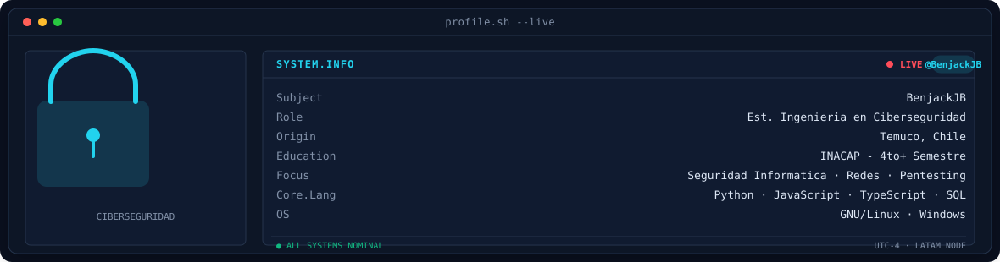
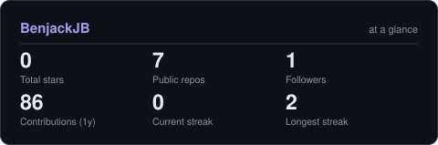

<!-- BANNER -->
<picture>
  <source media="(prefers-color-scheme: dark)"  srcset="assets/banner-dark.v9.svg">
  <source media="(prefers-color-scheme: light)" srcset="assets/banner-light.v9.svg">
  
</picture>

 

<!-- NAME / TAGLINE - animated typing -->

 

<!-- GITHUB BADGE -->

---

## Hola, soy Benjack 👋

Estudiante de **Ingeniería en Ciberseguridad** en **INACAP Temuco**, Chile 🇨🇱.
Actualmente en **4°+ semestre**, construyendo las bases para proteger el mundo digital.

- 🔒 **Enfoque:** Seguridad informática, redes y administración de sistemas
- 💻 **Stack actual:** Python, JavaScript, TypeScript, SQL, MongoDB, PHP
- 🐧 **Sistemas:** Experiencia en GNU/Linux y Windows Server
- 🌱 **Meta:** Convertirme en profesional de ciberseguridad con capacidad de auditoría, pentesting y hardening de infraestructuras
- 💡 **Filosofía:** Entender cómo se construye para saber cómo se protege

 

## mi stack`

---

## señales 

<table>
<tr>
<td width="50%" align="center" valign="middle">

<!-- Self-rated radar -->
<picture>
  <source media="(prefers-color-scheme: dark)"  srcset="assets/radar-dark.svg">
  <source media="(prefers-color-scheme: light)" srcset="assets/radar-light.svg">
  
</picture>

</td>
<td width="50%" align="center" valign="middle">

<!-- Language mix radar -->
<picture>
  <source media="(prefers-color-scheme: dark)"  srcset="assets/radar-langs-dark.svg">
  <source media="(prefers-color-scheme: light)" srcset="assets/radar-langs-light.svg">
  
</picture>

</td>
</tr>
</table>

---

## Números matter 

<picture>
  <source media="(prefers-color-scheme: dark)"  srcset="assets/card-stats-dark.svg">
  <source media="(prefers-color-scheme: light)" srcset="assets/card-stats-light.svg">
  
</picture>

 

---

` Build with love · @BenjackJB `

